# Arquitectura del Data Warehouse ETL

## Descripción General

Este documento describe la arquitectura completa del sistema de Data Warehouse con proceso ETL (Extract, Transform, Load) que procesa múltiples tipos de fuentes de datos y los carga en MongoDB.

## Arquitectura del Sistema

## Proceso ETL Detallado

### Flujo General del Proceso ETL

```mermaid
sequenceDiagram
    participant User as Usuario/API
    participant Orchestrator as ETLOrchestrator
    participant Extractor as DataExtractor
    participant Transformer as DataTransformer
    participant Loader as DataLoader
    participant MongoDB as MongoDB

    User->>Orchestrator: Ejecutar Proceso ETL
    activate Orchestrator
    
    Note over Orchestrator: Fase 1: EXTRACT
    Orchestrator->>Extractor: Extraer datos según tipo
    activate Extractor
    Extractor->>Extractor: Leer archivo fuente
    Extractor->>Extractor: Parsear según formato
    Extractor-->>Orchestrator: Datos extraídos (raw)
    deactivate Extractor
    
    Note over Orchestrator: Fase 2: TRANSFORM
    Orchestrator->>Transformer: Transformar datos
    activate Transformer
    Transformer->>Transformer: Normalizar estructura
    Transformer->>Transformer: Convertir tipos de datos
    Transformer->>Transformer: Aplicar mappings
    Transformer->>Transformer: Validar datos
    Transformer-->>Orchestrator: Datos transformados
    deactivate Transformer
    
    Note over Orchestrator: Fase 3: LOAD
    Orchestrator->>Loader: Cargar a MongoDB
    activate Loader
    Loop Para cada registro
        Loader->>MongoDB: Upsert (insert/update)
        MongoDB-->>Loader: Resultado
    end
    Loader-->>Orchestrator: Resultado ETL
    deactivate Loader
    
    Orchestrator-->>User: Resultado completo
    deactivate Orchestrator
```

## Componentes del Sistema

### 1. Capa de Extracción (Extract)

La capa de extracción es responsable de leer y parsear datos de diferentes fuentes.

#### Tipos de Fuentes de Datos

1. **CSV (Datos Estructurados)**
   - Formato: Filas y columnas delimitadas por comas
   - Parser: `csv-parse`
   - Ejemplo: `structured_data.csv` → Productos

2. **JSON (Datos Semi-estructurados)**
   - Formato: Objetos JavaScript anidados
   - Parser: `JSON.parse()`
   - Ejemplo: `json_data.json` → Clientes

3. **XML (Datos Jerárquicos)**
   - Formato: Estructura jerárquica con tags
   - Parser: `xml2js`
   - Ejemplo: `xml_data.xml` → Órdenes

4. **TXT (Datos No Estructurados)**
   - Formato: Texto plano con información semántica
   - Parser: Expresiones regulares
   - Ejemplo: `unstructured_data.txt` → Reportes de ventas

5. **Metadata (Metadatos)**
   - Formato: JSON con información del esquema
   - Parser: `JSON.parse()` con conversión de fechas
   - Ejemplo: `metadata.json` → Esquemas y calidad

### 2. Capa de Transformación (Transform)

La capa de transformación normaliza y convierte los datos al modelo unificado del Data Warehouse.

#### Sistema de Mapping

El sistema de mapping permite definir cómo se transforman los campos desde las fuentes al modelo del Data Warehouse.

#### Transformaciones Disponibles

| Transformación | Descripción | Ejemplo |
|---------------|-------------|---------|
| `uppercase` | Convierte a mayúsculas | "laptop" → "LAPTOP" |
| `lowercase` | Convierte a minúsculas | "LAPTOP" → "laptop" |
| `trim` | Elimina espacios | " laptop " → "laptop" |
| `parseFloat` | Convierte a número decimal | "1299.99" → 1299.99 |
| `parseInt` | Convierte a entero | "50" → 50 |
| `parseDate` | Convierte a fecha | "2024-01-15" → Date |
| `formatDate` | Formatea fecha | Date → "2024-01-15" |

### 3. Capa de Carga (Load)

La capa de carga inserta o actualiza los datos en MongoDB usando estrategia de upsert.

#### Estrategia de Upsert

## Modelo de Datos del Data Warehouse

### Esquema de Colecciones

## Flujo Completo de un Proceso ETL

### Ejemplo: Procesamiento de CSV a Products

## Arquitectura de la Aplicación

### Estructura de Capas

## Patrones de Diseño Utilizados

### 1. Orquestador (Orchestrator Pattern)

El `ETLOrchestrator` coordina las tres fases del proceso ETL:

### 2. Strategy Pattern (Extractores)

Cada tipo de fuente tiene su estrategia de extracción:

## Optimizaciones y Mejores Prácticas

### 1. Manejo de Errores

### 2. Índices de MongoDB

## Flujo de Datos End-to-End

## Consideraciones de Escalabilidad

### Procesamiento Paralelo (Futuro)

## Seguridad y Validación

### Validación de Datos

## Conclusión

Esta arquitectura proporciona:

1. **Modularidad**: Cada fase del ETL está separada y es independiente
2. **Extensibilidad**: Fácil agregar nuevos tipos de fuentes o transformaciones
3. **Robustez**: Manejo de errores sin detener el proceso completo
4. **Escalabilidad**: Diseño que permite procesamiento paralelo futuro
5. **Mantenibilidad**: Código organizado y bien documentado

El proceso ETL sigue las mejores prácticas de la industria, asegurando la calidad y consistencia de los datos en el Data Warehouse.
